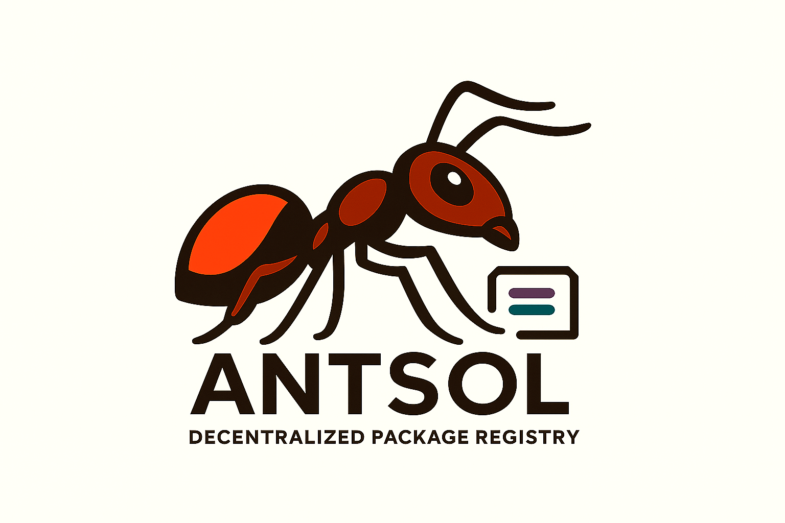
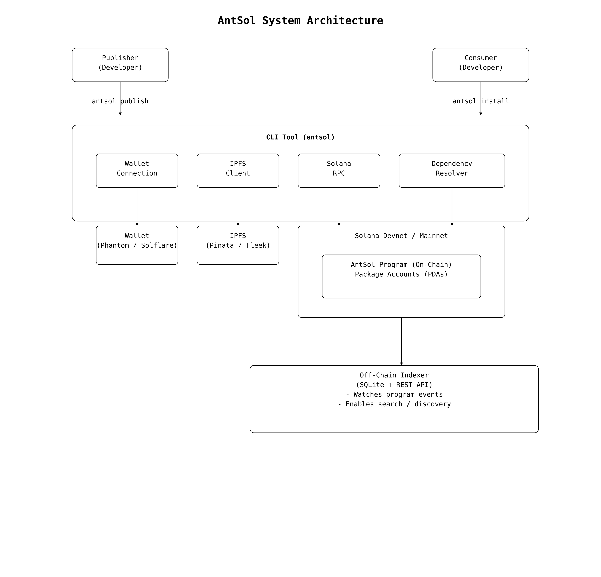
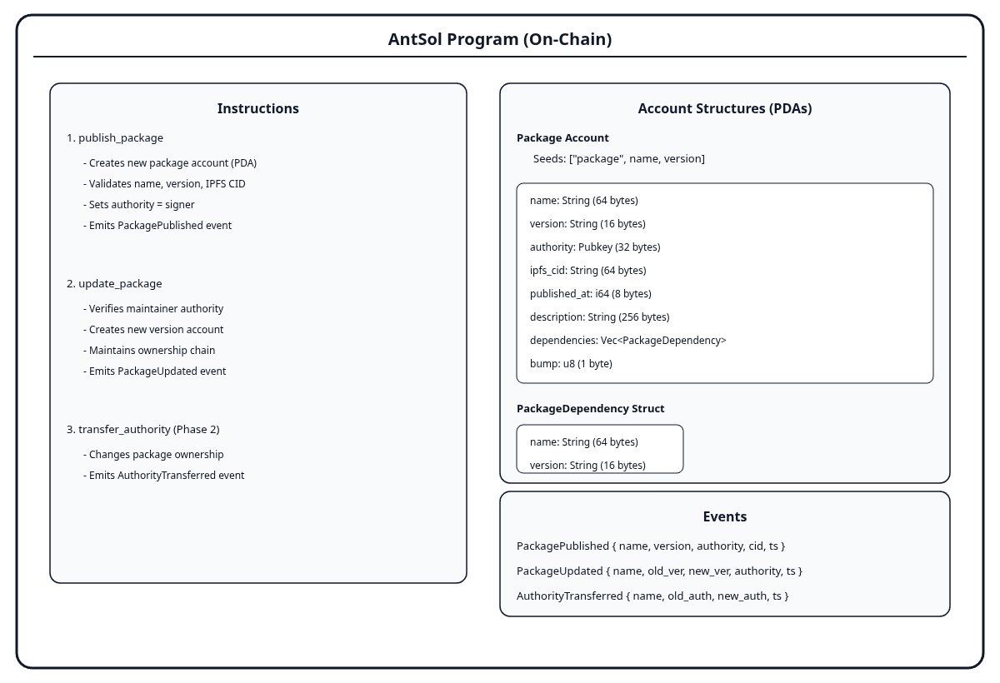

<div align="center">
  
  
  # AntSol - Decentralized Package Registry
  
  **Immutable. Censorship-Resistant. Blockchain-Native Package Management.**
  
  [](https://explorer.solana.com/)
  [](https://ipfs.tech/)
  [](https://www.rust-lang.org/)
  [](./LICENSE)
</div>

---

## 🌟 What is AntSol?

AntSol is a **fully decentralized package registry** built on Solana blockchain with IPFS storage. Unlike traditional package managers (npm, PyPI, cargo), AntSol ensures your packages are:

- 🔒 **Immutable** - Once published, packages cannot be modified or removed
- 🌐 **Censorship-Resistant** - No single entity controls the registry
- ✅ **Verifiable** - Cryptographic proof of package integrity via IPFS CID
- ⚡ **Fast** - Built on Solana for high-speed, low-cost transactions
- 🛡️ **Secure** - Blockchain-verified metadata prevents supply chain attacks

---

## 🚀 Components

### 1. **antsol-cli** - Command Line Interface
User-facing tool for publishing and installing packages.

**Key Commands:**
```bash
antsol init              # Initialize a new package
antsol publish           # Publish package to blockchain + IPFS
antsol install <package> # Install package from registry
antsol search <query>    # Search packages
```

**Technologies:** Rust, Solana SDK, IPFS

[📖 View CLI Documentation](./antsol-cli/README.md)

---

### 2. **antsol-registry** - Smart Contract
Solana program (smart contract) that stores package metadata on-chain.

**Features:**
- Package registration and version management
- Immutable on-chain metadata storage
- Event emission for indexer synchronization

**Technologies:** Anchor Framework, Rust

**Program ID:** `A9igkBugcujD9Nw9d97FFN4aY3qHXnJxEqCChJt8C42S`

[📖 View Registry Documentation](./antsol-registry/README.md)

---

### 3. **antsol-indexer-v2** - Blockchain Indexer & API
Backend service that scans the blockchain, indexes packages, and provides a REST API.

**Features:**
- Continuous blockchain scanning and event parsing
- PostgreSQL database for fast package queries
- REST API for search and discovery
- Docker deployment ready

**Technologies:** Rust, PostgreSQL, Axum, Docker

**API Endpoints:**
- `GET /api/packages` - List all packages
- `GET /api/packages/:name` - Get package details
- `GET /api/search?q=term` - Search packages
- `GET /api/stats` - Registry statistics

[📖 View Indexer Documentation](./antsol-indexer-v2/README.md)

---

## 🏗️ Architecture Overview

<div align="center">
  
</div>

### System Components

<div align="center">
  
</div>

```
┌─────────────────────────────────────────────────────────┐
│                    AntSol Ecosystem                      │
└─────────────────────────────────────────────────────────┘

   Developer Machine         Blockchain Layer          Storage Layer
   ┌──────────────┐         ┌──────────────┐          ┌──────────────┐
   │              │         │              │          │              │
   │  AntSol CLI  │─publish→│    Solana    │----------|    IPFS     |
   │   (Rust)     │         │   Devnet     │          │  Distributed │
   │              │←─query──│   Program    │          │   Storage    │
   └──────────────┘         │   (Anchor)   │          │              │
          │                 └──────────────┘          └──────────────┘
          │                        │                          ▲
          │                        │                          │
          │                        ▼                          │
          │                 ┌──────────────┐                  │
          │                 │              │                  │
          └────install──────│   Indexer    │────fetches──────┘
                            │ (Rust +      │
                            │ PostgreSQL)  │
                            │              │
                            └──────────────┘
                                   │
                                   ▼
                            ┌──────────────┐
                            │   REST API   │
                            │  (Search &   │
                            │  Discovery)  │
                            └──────────────┘
```

### Data Flow

**1. Publish Flow:**
   - Developer uses CLI to publish package
   - Package files uploaded to IPFS (immutable storage)
   - Metadata submitted to Solana smart contract
   - Transaction emits event with package info
   - IPFS returns CID (Content Identifier)

**2. Index Flow:**
   - Indexer continuously scans Solana blockchain
   - Parses package events from transactions
   - Stores metadata in PostgreSQL for fast queries
   - API serves package information to users

**3. Install Flow:**
   - CLI queries package metadata (from API or blockchain)
   - Downloads package files from IPFS using CID
   - Verifies integrity via content hash
   - Extracts package to destination directory

---

## 🚀 Quick Start


### Prerequisites
- **Rust** (latest stable) - [Install Rust](https://www.rust-lang.org/tools/install)
- **Solana CLI** - [Install Solana](https://docs.solana.com/cli/install-solana-cli-tools)
- **Node.js & npm** (for registry development)
- **Docker** (optional, for indexer deployment)
- **PostgreSQL 14+** (for indexer)

---

## 🧩 First-Time IPFS/Pinata Setup

AntSol uses IPFS to store package files. By default, it uses public IPFS gateways, but for reliable pinning and uploads, you should set up a pinning service like [Pinata](https://pinata.cloud/) or [web3.storage](https://web3.storage/).

### 1. Create a Pinata Account (Recommended)
1. Go to [Pinata Cloud](https://pinata.cloud/) and sign up for a free account.
2. In your Pinata dashboard, go to **API Keys** and create a new key.
3. Copy your **API Key** and **API Secret**.

### 2. Configure AntSol CLI for Pinata
Set the following environment variables before running `antsol publish`:

```bash
export PINATA_API_KEY=your_pinata_api_key
export PINATA_API_SECRET=your_pinata_api_secret
```

Or, add them to your shell profile (`~/.bashrc`, `~/.zshrc`).

> **Note:** If you do not set these, AntSol will attempt to use a public IPFS node, which may be unreliable for uploads. Pinata is strongly recommended for production or demo use.

### 3. First-Time Publish Experience
- On your first `antsol publish`, the CLI will attempt to upload your package to IPFS using your configured pinning service.
- If credentials are missing or invalid, you will see an error and the publish will fail.
- If successful, you will see the IPFS CID in the output.

### 4. Troubleshooting
- **Upload fails:** Double-check your Pinata API credentials and network connection.
- **No CID returned:** Ensure your API key has pinning permissions.
- **Still stuck?** Try [web3.storage](https://web3.storage/) as an alternative, or open a GitHub issue.

---

### Installation

#### 1. Clone the Repository
```bash
git clone https://github.com/yourusername/antsol.git
cd antsol
```

#### 2. Build & Install CLI
```bash
cd antsol-cli
cargo build --release

# Add to PATH or copy binary
cp target/release/antsol ~/.local/bin/
# OR
export PATH="$PATH:$(pwd)/target/release"
```

#### 3. Setup Wallet
```bash
# Create a new wallet (or use existing)
solana-keygen new --outfile ~/.config/solana/antsol-wallet.json

# Set wallet for AntSol CLI
antsol wallet connect ~/.config/solana/antsol-wallet.json

# Request devnet SOL (for testing)
solana airdrop 2 --keypair ~/.config/solana/antsol-wallet.json
```

#### 4. Deploy Smart Contract (Optional - already deployed)
```bash
cd antsol-registry
anchor build
anchor deploy --provider.cluster devnet
```

**✅ Deployed Program ID:** `A9igkBugcujD9Nw9d97FFN4aY3qHXnJxEqCChJt8C42S`

#### 5. Run Indexer (Optional - for registry operators)
```bash
cd antsol-indexer-v2
cp .env.example .env

# Edit .env with your credentials:
# - DATABASE_URL (PostgreSQL connection string)
# - SOLANA_RPC_URL (Solana devnet RPC endpoint)

cargo run --release
```

---

## 📦 Usage Examples

### Publishing a Package

```bash
# Navigate to your project directory
cd my-awesome-package

# Initialize AntSol configuration
antsol init
# Follow prompts:
#   Package name: my-awesome-package
#   Version: 1.0.0
#   Description: An awesome decentralized package

# Publish to decentralized registry
antsol publish
```

**Output:**
```
✓ Uploaded to IPFS: QmXxXxXxXxXxXxXxXxXxXxXxXxXxXxXxXxXxXxXxXxXx
✓ Published my-awesome-package@1.0.0

Package Details:
  IPFS CID: QmXxXxXxXxXxXxXxXxXxXxXxXxXxXxXxXxXxXxXxXxXx
  Transaction: 4eUk43Fu82DP2ynWDeCki...
  Explorer: https://explorer.solana.com/tx/4eUk43Fu...?cluster=devnet
```

### Installing a Package

```bash
# Install specific version
antsol install my-awesome-package@1.0.0

# Install latest version
antsol install my-awesome-package

# Install to specific directory
antsol install my-awesome-package --path ./packages/
```

### Searching Packages

```bash
# Search via CLI
antsol search "math utilities"

# Search via API
curl https://api.antsol.dev/api/search?q=math
```

### Package Information

```bash
# Get package details
antsol info my-awesome-package

# List all versions
antsol versions my-awesome-package
```

---

## 🔧 Development

### Project Structure

```
antsol/
├── logo.png                 # Project logo
├── architecture.jpg         # Architecture diagram
├── architecture-diagram.png # System components diagram
├── README.md                # This file
│
├── antsol-cli/              # Command-line interface (Rust)
│   ├── src/
│   │   ├── main.rs          # Entry point
│   │   ├── commands/        # CLI commands (init, publish, install)
│   │   ├── ipfs/            # IPFS integration
│   │   └── solana/          # Blockchain interaction
│   ├── Cargo.toml
│   └── README.md
│
├── antsol-registry/         # Smart contract (Anchor/Rust)
│   ├── programs/
│   │   └── antsol-registry/
│   │       └── src/lib.rs   # Program logic
│   ├── tests/               # Integration tests
│   ├── Anchor.toml          # Anchor configuration
│   └── README.md
│
└── antsol-indexer-v2/       # Indexer + API (Rust)
    ├── src/
    │   ├── main.rs          # Entry point
    │   ├── indexer/         # Blockchain scanner
    │   │   ├── listener.rs  # Event listener
    │   │   └── parser.rs    # Event parser
    │   ├── db/              # Database queries
    │   │   ├── models.rs    # Data models
    │   │   └── queries.rs   # SQL queries
    │   └── api/             # REST endpoints
    │       └── handlers.rs  # API handlers
    ├── migrations/          # SQL migrations
    ├── Dockerfile           # Docker image
    ├── docker-compose.yml   # Docker Compose setup
    ├── .env.example         # Environment template
    └── README.md
```

### Running Tests

```bash
# Test CLI
cd antsol-cli
cargo test

# Test smart contract
cd antsol-registry
anchor test

# Test indexer
cd antsol-indexer-v2
cargo test
```

### Building for Production

```bash
# Build CLI
cd antsol-cli
cargo build --release

# Build indexer
cd antsol-indexer-v2
cargo build --release

# Build smart contract
cd antsol-registry
anchor build
```

---

## 🔒 Security

### Best Practices

- ✅ **Never commit `.env` files** - Use `.env.example` as template
- ✅ **All credentials must be user-provided** - No secrets in code
- ✅ **IPFS provides content integrity** - CID = cryptographic hash of content
- ✅ **Blockchain provides immutability** - Published packages cannot be modified
- ✅ **Wallet security** - Keep private keys secure, never share
- ✅ **Smart contract auditing** - Code is open-source for review

### Threat Model

**What AntSol Protects Against:**
- ❌ Package censorship (decentralized storage)
- ❌ Supply chain attacks (blockchain verification)
- ❌ Package tampering (IPFS content addressing)
- ❌ Centralized control (no single point of failure)

**What Users Should Be Aware Of:**
- ⚠️ Wallet security (keep private keys safe)
- ⚠️ IPFS availability (packages pinned by publishers)
- ⚠️ Transaction costs (~0.001 SOL per publish)

---

## 🛣️ Roadmap

### ✅ Completed
- [x] CLI for publish/install operations
- [x] Smart contract deployed on Solana devnet
- [x] Indexer with PostgreSQL database
- [x] REST API for package discovery
- [x] Docker deployment support
- [x] IPFS integration for immutable storage

### 🚧 In Progress
- [ ] Enhanced search (fuzzy matching, filters)
- [ ] Multi-signature package verification
- [ ] Analytics dashboard for package stats

### 🔮 Future Plans
- [ ] Mainnet deployment
- [ ] Integration with existing package ecosystems (npm, cargo, pip)
- [ ] DAO governance for registry policies
- [ ] Cross-chain compatibility
- [ ] Tokenomics for storage incentives
- [ ] Package dependency resolution
- [ ] Automated security scanning

---

## 💰 Economics

### Publishing Costs
- **Transaction fee:** ~0.001 SOL (~$0.10 USD at current prices)
- **IPFS storage:** FREE (with pinning service) or $5/month for 100GB
- **No recurring fees** once published

### Installing Costs
- **FREE** - Downloads from IPFS
- **No subscription fees**
- **No API rate limits**

---

## 📚 Documentation

- **[CLI Usage Guide](./antsol-cli/README.md)** - Complete CLI documentation
- **[Smart Contract API](./antsol-registry/README.md)** - Program interface and events
- **[Indexer & API](./antsol-indexer-v2/README.md)** - Backend architecture and deployment
- **[Contributing Guide](./CONTRIBUTING.md)** - How to contribute to AntSol

---

## 📄 License

MIT License - see [LICENSE](./LICENSE) file for details

---

## 🤝 Contributing

We welcome contributions! Whether it's:

- 🐛 Bug reports
- 💡 Feature requests
- 📖 Documentation improvements
- 🔧 Code contributions

**Please:**
1. Open an issue to discuss changes
2. Fork the repository
3. Create a feature branch
4. Submit a pull request

---

## 📞 Contact & Support

- **GitHub Issues:** [Report bugs or request features](https://github.com/yourusername/antsol/issues)
- **Documentation:** [Full docs](https://docs.antsol.dev)
- **Community:** [Join our Discord](#)
- **Twitter:** [@AntSolDev](#)

---

## 🌟 Acknowledgments

Built with:
- [Solana](https://solana.com/) - High-performance blockchain
- [IPFS](https://ipfs.tech/) - Decentralized storage
- [Anchor](https://www.anchor-lang.com/) - Solana framework
- [Rust](https://www.rust-lang.org/) - Systems programming language

---

<div align="center">
  <strong>Built with ❤️ for decentralized package management</strong>
  
  ⭐ Star us on GitHub | 🐦 Follow on Twitter | 📖 Read the Docs
</div>
